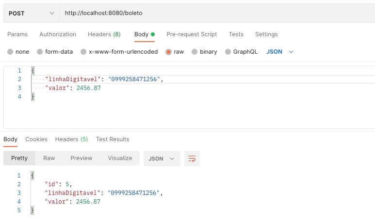
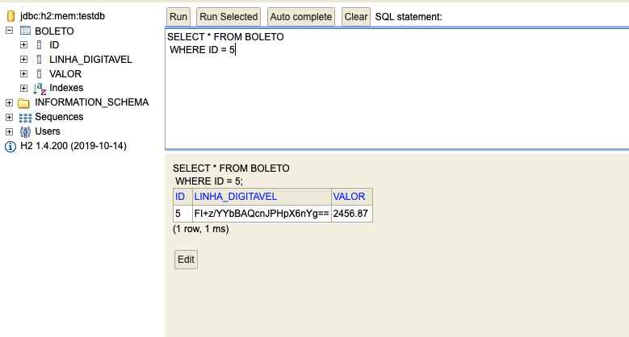
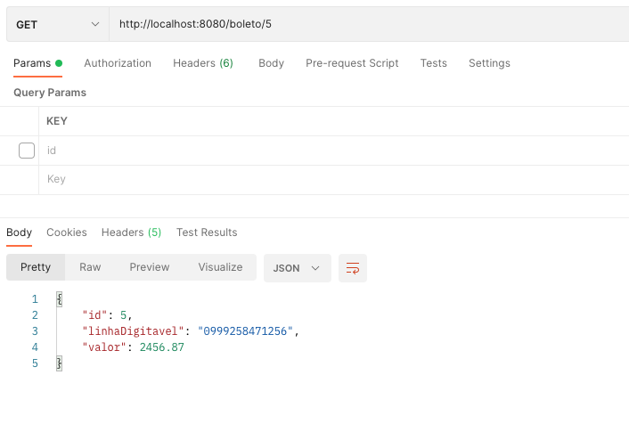

# Spring Boot - Criptografia de dados do Boleto com AES256

Os dados do boleto são criptografados na aplicação antes de serem salvos no banco de dados.
No processo de recuperação, é realizada a descriptografia da informação.

A classe Boleto trabalha com dados criptografados e a classe BoletoDTO trabalha com os dados descriptografados.

## Chamada da API para salvar o boleto

## Informação salva no banco de dados criptografada

## Chamada da API para recuperar o boleto

As camadas de serviços e configurações foram removidas para simplificar e facilitar o entendimento.
As chaves de criptografia não devem ficar no código-fonte!
